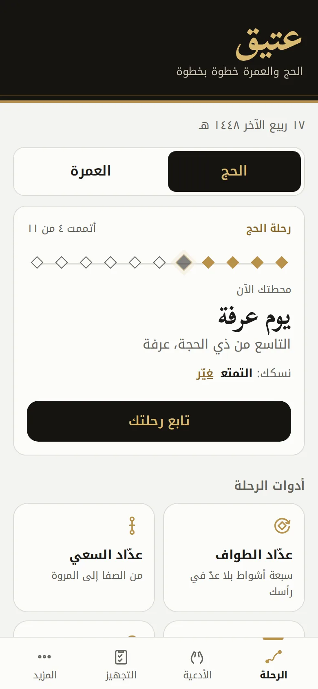
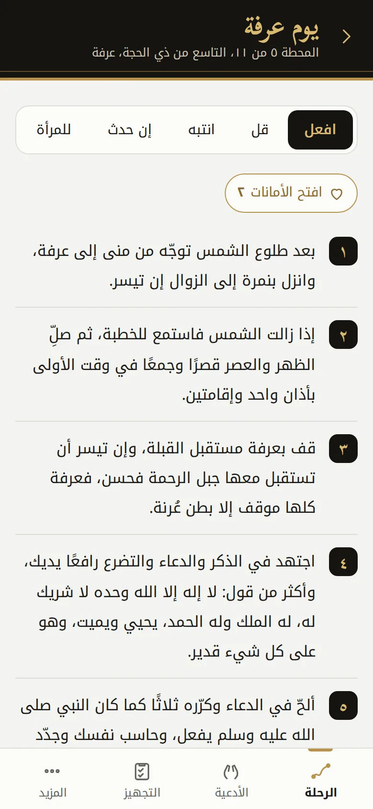
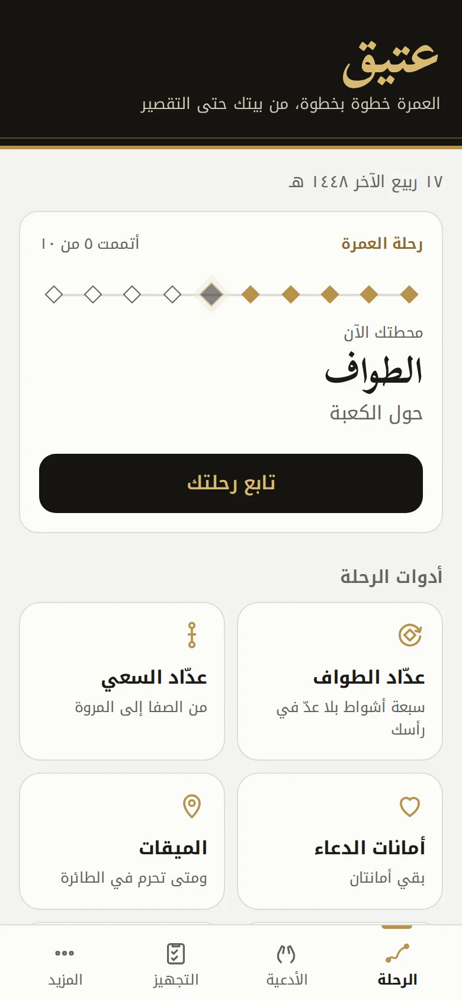
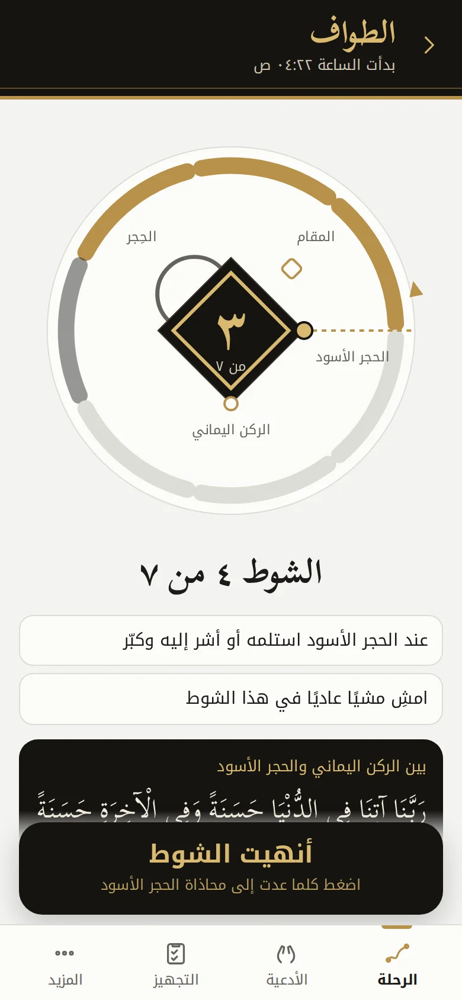

<p align="center"></p>

<h1 align="center">عتيق</h1>
<p align="center"><b>Ateeq</b>, Hajj and Umrah step by step, every station with what to do, what to say and what to avoid</p>
<p align="center"><a href="https://ateeq.3li.info/app/">افتح التطبيق · Open the app</a> &nbsp;|&nbsp; <a href="https://ateeq.3li.info/">الموقع · Website</a></p>

<p align="center">




</p>

<div dir="rtl">

## عتيق

عتيق تطبيق مجاني مفتوح المصدر يجمع صفة الحج والعمرة كما شرحها الشيخ عبدالعزيز بن باز رحمه الله، فيقسم الحج إلى إحدى عشرة محطة والعمرة إلى عشر، لكل محطة ما تفعله وما تقوله وما تنتبه له، ومعها عدّاد للطواف والسعي وأمانات الدعاء والتجهيز، ويعمل كله دون إنترنت ودون حساب.

سُمّي «عتيق» من قوله تعالى: ﴿وَلْيَطَّوَّفُوا بِالْبَيْتِ الْعَتِيقِ﴾، ومن العتق من النار الذي يُرجى يوم عرفة.

### ما فيه

- **رحلة الحج:** إحدى عشرة محطة من السفر حتى طواف الوداع، مرورًا بيوم التروية وعرفة ومزدلفة ويوم النحر وأيام التشريق، وكل محطة مقسومة إلى افعل وقل وانتبه وإن حدث وللمرأة، مع مصادرها.
- **الحج بحسب نسكك:** تختار التمتع أو القران أو الإفراد فتتغيّر التعليمات في كل محطة، من لفظ الإحرام إلى الهدي والسعي.
- **رحلة العمرة:** عشر محطات من السفر حتى التقصير، بالأبواب الخمسة نفسها.
- **عدّاد الطواف:** لطواف العمرة والقدوم والإفاضة والوداع، برسم للكعبة من الأعلى بالحجر الأسود والركن اليماني والحِجر، وزر كبير يعدّ الأشواط، ولا يذكّر بالرمل والاضطباع إلا في الطواف الأول، ويحفظ العدد إذا أقيمت الصلاة، ويبني على الأقل عند الشك، ويُبقي الشاشة مضاءة.
- **عدّاد السعي:** لسعي العمرة وسعي الحج، يعرف أين تقف، فيعرض ذكر الصفا والمروة ثلاث مرات، والآية في بداية الشوط الأول فقط، وينبّه الرجال عند العلمين الأخضرين، وينتهي بك على المروة.
- **أمانات الدعاء:** تكتب قبل سفرك من أوصاك بالدعاء، فتظهر القائمة في مواطن الإجابة على الصفا والمروة وفي الطواف ويوم عرفة وعند الجمرات.
- **الميقات وتنبيه الطائرة:** المواقيت الخمسة ومن يحرم من أين، وتنبيه قبل الوصول إلى جدة يحسب الوقت بتوقيت جدة مهما كان توقيت الهاتف.
- **التجهيز:** قوائم للحج والعمرة تبدأ بالقلب، من التوبة وردّ المظالم وكتابة الديون، ثم العلم والحقيبة والأوراق، مع بنودك الخاصة.
- **أدعية المناسك:** أدعية الإحرام والطواف والسعي، وذكر يوم عرفة وجوامع الدعاء فيه، وذكر المشعر الحرام، والتكبير مع الحصى، ودعاء ذبح الهدي.
- **المظهر:** ست لوحات ألوان فاخرة أو لونان تختارهما بنفسك، مع الوضع الفاتح والليلي، ويضبط التطبيق الدرجات حتى يبقى النص واضحًا، وتفرض الاختبارات ذلك على كل لوحة.
- **سهولة الاستخدام:** أربعة أحجام لخط التطبيق، وخط أعرض، وتباين أعلى، وتباعد أوسع بين الأسطر، وتقليل الحركة، ويعلن قارئ الشاشة رقم كل شوط.
- **باب الأدعية:** ثلاثون بابًا وأكثر من أربعمئة وخمسين دعاءً، مع البحث والمفضلة وقائمة دعائي.
- **بلا إنترنت وبلا حساب:** يحتاج الإنترنت في أول فتح فقط، ثم يعمل دونه، ولا تغادر بياناتك جهازك.
- **عربي وإنجليزي:** يفتح بلغة جهازك، مع الوضع الليلي وتكبير خط الأدعية.

### المصادر

- [صفة العمرة، للشيخ ابن باز، رئاسة الشؤون الدينية بالمسجد الحرام والمسجد النبوي](https://risala.prh.gov.sa/storage/contents/63/ar-sifat_umrah-2.pdf)
- [التحقيق والإيضاح لكثير من مسائل الحج والعمرة والزيارة، للشيخ ابن باز](https://risala.prh.gov.sa/storage/contents/209/ar_attahqiq.pdf)
- [فتوى صفة العمرة](https://binbaz.org.sa/fatwas/11982)
- [فتوى صفة مناسك الحج الثلاثة](https://binbaz.org.sa/fatwas/16511)
- [فتوى كيفية إحرام من كان على الطائرة أو السفينة](https://binbaz.org.sa/fatwas/1640)
- [فتوى بداية رمي الجمار ونهايته](https://binbaz.org.sa/fatwas/16100)
- [صفة العمرة من الشرح الفقهي المصور، شبكة صيد الفوائد](https://saaid.org/rasael/omrah/index.htm)
- [دليل المعتمر، جمع طلال بن أحمد العقيل](https://www.alukah.net/books/files/book_9185/bookfile/dalil.pdf)

روجعت الأدعية كلها، فحُذف منها ما يخالف منهج الشيخ ابن باز في الدعاء، كالتوسل بحق المخلوقين وبجاه النبي صلى الله عليه وسلم، والدعاء بأسماء لم تثبت، وضُبط ما كان من القرآن والسنة بالشكل، وقُرن كل آية بسورتها ورقمها.

### التشغيل على جهازك

```
python3 -m http.server 8080 --directory docs
```

ثم افتح `http://localhost:8080/app/` في المتصفح، وتشغّل الاختبارات بالأمر `npm test`.

### الخطة

1. الويب وتطبيق يُثبّت على الشاشة الرئيسية، وهو منشور.
2. تطبيق آيفون، وهو في المجلد `ios/` ويُبنى على GitHub ويُفتح في المحاكي مع كل تغيير، وينتظر النشر في المتجر.
3. تطبيق أندرويد.

### تطبيق آيفون

يحمل التطبيق صفحات عتيق وبياناته وخطوطه داخله، فيعمل كله دون إنترنت، ويضيف ما لا يقدر عليه المتصفح: تنبيه الإحرام في الطائرة إشعارًا حقيقيًا ولو كان التطبيق مغلقًا، واهتزازًا مع كل شوط، وإبقاء الشاشة مضاءة في الطواف والسعي، وورقة المشاركة، وحجم الخط الذي اخترته في إعدادات الهاتف.

- `ios/project.yml` يولّد مشروع Xcode بأداة XcodeGen، و`tools/ios/sync-web.sh` ينسخ `docs/` إلى داخل التطبيق، فلا نسخة ثانية من المحتوى في المستودع.
- `.github/workflows/ios.yml` يبني التطبيق ويفتحه في محاكي آيفون على الشاشات نفسها التي في صور الموقع، ويحفظ الصور.
- `.github/workflows/ios-release.yml` يوقّع التطبيق ويرفعه إلى TestFlight عند وسم `ios-v1.0.0`، ويحتاج خمسة أسرار في المستودع مذكورة في رأس الملف.

### الرخصة

مفتوح المصدر برخصة MIT، من صنع علي العنزي.

</div>

---

## Ateeq

Ateeq is a free, open-source app that brings together the description of Hajj and Umrah as Shaykh Abdulaziz ibn Baz explained it. Hajj comes in eleven stations and Umrah in ten, each with what to do, what to say and what to avoid, alongside counters for tawaf and saʿi, dua trusts and preparation. Everything works offline and with no account.

The name comes from the verse "and let them circle the Ancient House" (al-Bayt al-Ateeq), and from the freeing from the Fire hoped for on the Day of Arafah.

### What is inside

- **The Hajj journey:** eleven stations from setting out to the farewell tawaf, through Tarwiyah, Arafah, Muzdalifah, the Day of Sacrifice and the days of Tashriq, each split into Do, Say, Avoid, What if and Women, with its sources.
- **Hajj that follows your form:** choose tamattuʿ, qiran or ifrad and every station adjusts, from the words of ihram to the sacrifice and the saʿi.
- **The Umrah journey:** ten stations from setting out to the final trim, with the same five parts.
- **Tawaf counter:** for the Umrah, arrival, ifadah and farewell tawaf, with brisk walking tips only in the first tawaf, a top-down Kaaba with the Black Stone, the Yemeni corner and the Hijr, one large button per circuit, a saved count when the prayer starts, the lower number when in doubt, and the screen kept awake.
- **Saʿi counter:** for the saʿi of Umrah and of Hajj, knows where you stand, shows the Safa and Marwah remembrance three times, the verse at the start of the first lap only, the green markers for men, and ends you at Marwah.
- **Dua trusts:** write down before you travel who asked you to pray for them. The list comes up where prayers are answered, on Safa and Marwah, in tawaf, on the Day of Arafah and at the Jamarat.
- **Miqat and plane alert:** the five miqats and who enters ihram where, with an alert before landing in Jeddah timed in Jeddah time whatever the phone clock says.
- **Preparation:** Hajj and Umrah checklists that begin with the heart, then knowledge, the bag and the papers, plus your own items.
- **Supplications of the rites:** ihram, tawaf and saʿi, the remembrance and comprehensive duas of Arafah, al-Mashʿar al-Haram, the takbir with each pebble and the words at the sacrifice.
- **Appearance:** six refined palettes or two colours of your own, in light or dark mode. The app tunes the shades so text stays clear, and the tests hold every palette to it.
- **Accessibility:** four app text sizes, bolder text, higher contrast, wider line spacing, reduced motion, and screen readers announce every circuit.
- **Duas library:** thirty topics and more than 450 supplications, with search, saving and a list of your own.
- **Offline, no account:** the internet is needed on the first visit only, and your data never leaves your device.
- **Arabic and English:** opens in your device language, with a dark theme and a larger dua font.

### Sources

The same eight sources listed above, all linked from inside the app. The supplications were reviewed, and anything that conflicts with Shaykh Ibn Baz's approach to supplication was left out, such as asking by the right or rank of a created being and names of Allah that are not established. Quran and Sunnah texts carry full vowel marks, and every verse carries its surah and number.

### Run it locally

```
python3 -m http.server 8080 --directory docs
```

Then open `http://localhost:8080/app/`. Run the tests with `npm test`.

### Project layout

```
docs/              the site and the app, served by GitHub Pages
  index.html       the explanation site
  app/             the app: index.html, app.js, logic.js, palettes.js, app.css
  data/            rite.json (Umrah and Hajj journeys, forms of Hajj, miqat, preparation), duas.json, i18n.json
  fonts/           self-hosted Noto Kufi Arabic and Scheherazade New, SIL Open Font License
  sw.js            the offline cache
tests/             content and logic tests
ios/               the iPhone app: project.yml, Swift sources, asset catalog
tools/shots.mjs    renders the screenshots, from the scenes in tools/scenes.mjs
tools/brand/       draws the mark and renders every icon size
tools/ios/         copies the web app into the iPhone app, prints simulator scenes, prepares App Store signing
```

### Roadmap

1. Web and an installable home screen app, published.
2. iPhone app, in `ios/`, built on GitHub and opened in the simulator on every change, waiting for the store.
3. Android app.

### The iPhone app

The app carries Ateeq's pages, data and fonts inside it, so it works entirely offline, and it adds what a browser cannot: the plane ihram alert as a real notification even when the app is closed, a tap with every circuit, the screen kept on during tawaf and saʿi, the share sheet, and the text size chosen in the phone's settings.

- `ios/project.yml` generates the Xcode project with XcodeGen, and `tools/ios/sync-web.sh` copies `docs/` into the app, so the repository holds no second copy of the content.
- `.github/workflows/ios.yml` builds the app and opens it in an iPhone simulator on the same screens as the site screenshots, and keeps the pictures.
- `.github/workflows/ios-release.yml` signs the app and uploads it to TestFlight on an `ios-v1.0.0` tag. It needs five repository secrets, listed at the top of the file.

### Licence

MIT, made by Ali AlEnezi.
