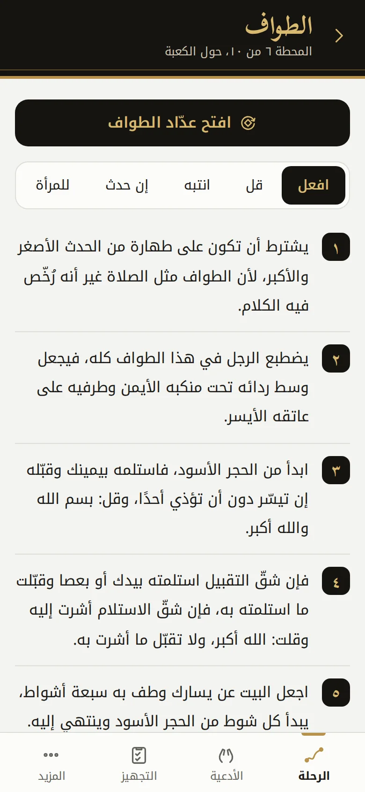
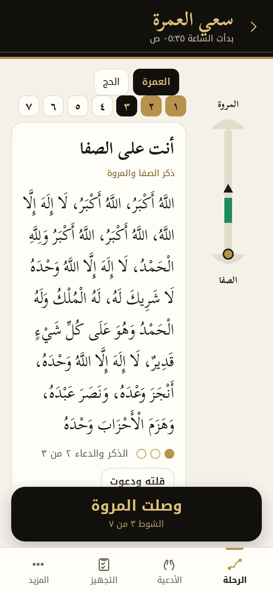

<p align="center"></p>

<h1 align="center">عتيق</h1>
<p align="center"><b>Ateeq</b>, Umrah step by step, from your door to the final trim</p>
<p align="center"><a href="https://ateeq.3li.info/app/">افتح التطبيق · Open the app</a> &nbsp;|&nbsp; <a href="https://ateeq.3li.info/">الموقع · Website</a></p>

<p align="center">




</p>

<div dir="rtl">

## عتيق

عتيق تطبيق مجاني مفتوح المصدر يجمع صفة العمرة كما شرحها الشيخ عبدالعزيز بن باز رحمه الله، فيقسم الرحلة إلى عشر محطات لكل منها ما تفعله وما تقوله وما تنتبه له، ومعها عدّاد للطواف والسعي، وأمانات الدعاء، والتجهيز قبل العمرة والحج، ويعمل كله دون إنترنت ودون حساب.

سُمّي «عتيق» من قوله تعالى: ﴿وَلْيَطَّوَّفُوا بِالْبَيْتِ الْعَتِيقِ﴾، ومن العتق من النار الذي يُرجى يوم عرفة.

### ما فيه

- **الرحلة بمحطاتها:** عشر محطات من السفر حتى التقصير، وكل محطة مقسومة إلى افعل وقل وانتبه وإن حدث وللمرأة، مع مصادرها.
- **عدّاد الطواف:** رسم للكعبة من الأعلى بالحجر الأسود والركن اليماني والحِجر، وزر كبير يعدّ الأشواط، ويحفظ العدد إذا أقيمت الصلاة، ويبني على الأقل عند الشك، ويُبقي الشاشة مضاءة.
- **عدّاد السعي:** يعرف أين تقف، فيعرض ذكر الصفا والمروة ثلاث مرات، والآية في بداية الشوط الأول فقط، وينبّه الرجال عند العلمين الأخضرين، وينتهي بك على المروة.
- **أمانات الدعاء:** تكتب قبل سفرك من أوصاك بالدعاء، فتظهر القائمة في مواطن الإجابة على الصفا والمروة وفي الطواف ويوم عرفة.
- **الميقات وتنبيه الطائرة:** المواقيت الخمسة ومن يحرم من أين، وتنبيه قبل الوصول إلى جدة يحسب الوقت بتوقيت جدة مهما كان توقيت الهاتف.
- **التجهيز:** قوائم للعمرة والحج تبدأ بالقلب، من التوبة وردّ المظالم وكتابة الديون، ثم العلم والحقيبة والأوراق، مع بنودك الخاصة.
- **الحج:** الأنساك الثلاثة، ثم الأيام من الثامن إلى الثالث عشر، مع الأذكار والأدعية في كل يوم.
- **باب الأدعية:** ثلاثون بابًا وأكثر من أربعمئة وخمسين دعاءً، مع البحث والمفضلة وقائمة دعائي.
- **بلا إنترنت وبلا حساب:** يحتاج الإنترنت في أول فتح فقط، ثم يعمل دونه، ولا تغادر بياناتك جهازك.
- **عربي وإنجليزي:** يفتح بلغة جهازك، مع الوضع الليلي وتكبير خط الأدعية.

### المصادر

- [صفة العمرة، للشيخ ابن باز، رئاسة الشؤون الدينية بالمسجد الحرام والمسجد النبوي](https://risala.prh.gov.sa/storage/contents/63/ar-sifat_umrah-2.pdf)
- [التحقيق والإيضاح لكثير من مسائل الحج والعمرة والزيارة، للشيخ ابن باز](https://risala.prh.gov.sa/storage/contents/209/ar_attahqiq.pdf)
- [فتوى صفة العمرة](https://binbaz.org.sa/fatwas/11982)
- [فتوى صفة مناسك الحج الثلاثة](https://binbaz.org.sa/fatwas/16511)
- [فتوى كيفية إحرام من كان على الطائرة أو السفينة](https://binbaz.org.sa/fatwas/1640)
- [فتوى بداية رمي الجمار ونهايته](https://binbaz.org.sa/fatwas/16100)
- [صفة العمرة من الشرح الفقهي المصور، شبكة صيد الفوائد](https://saaid.org/rasael/omrah/index.htm)
- [دليل المعتمر، جمع طلال بن أحمد العقيل](https://www.alukah.net/books/files/book_9185/bookfile/dalil.pdf)

روجعت الأدعية كلها، فحُذف منها ما يخالف منهج الشيخ ابن باز في الدعاء، كالتوسل بحق المخلوقين وبجاه النبي صلى الله عليه وسلم، والدعاء بأسماء لم تثبت، وضُبط ما كان من القرآن والسنة بالشكل، وقُرن كل آية بسورتها ورقمها.

### التشغيل على جهازك

```
python3 -m http.server 8080 --directory docs
```

ثم افتح `http://localhost:8080/app/` في المتصفح، وتشغّل الاختبارات بالأمر `npm test`.

### الخطة

1. الويب وتطبيق يُثبّت على الشاشة الرئيسية، وهو هذا الإصدار.
2. تطبيق آيفون.
3. تطبيق أندرويد.

### الرخصة

مفتوح المصدر برخصة MIT، من صنع علي العنزي.

</div>

---

## Ateeq

Ateeq is a free, open-source app that brings together the description of Umrah as Shaykh Abdulaziz ibn Baz explained it. It splits the journey into ten stations, each with what to do, what to say and what to avoid, and adds counters for tawaf and saʿi, dua trusts, and preparation for Umrah and Hajj. Everything works offline and with no account.

The name comes from the verse "and let them circle the Ancient House" (al-Bayt al-Ateeq), and from the freeing from the Fire hoped for on the Day of Arafah.

### What is inside

- **The journey:** ten stations from setting out to the final trim, each split into Do, Say, Avoid, What if and Women, with its sources.
- **Tawaf counter:** a top-down Kaaba with the Black Stone, the Yemeni corner and the Hijr, one large button per circuit, a saved count when the prayer starts, the lower number when in doubt, and the screen kept awake.
- **Saʿi counter:** knows where you stand, shows the Safa and Marwah remembrance three times, the verse at the start of the first lap only, the green markers for men, and ends you at Marwah.
- **Dua trusts:** write down before you travel who asked you to pray for them. The list comes up where prayers are answered, on Safa and Marwah, in tawaf and on the Day of Arafah.
- **Miqat and plane alert:** the five miqats and who enters ihram where, with an alert before landing in Jeddah timed in Jeddah time whatever the phone clock says.
- **Preparation:** Umrah and Hajj checklists that begin with the heart, then knowledge, the bag and the papers, plus your own items.
- **Hajj:** the three forms, then the days from the 8th to the 13th, with the words for each day.
- **Duas library:** thirty topics and more than 450 supplications, with search, saving and a list of your own.
- **Offline, no account:** the internet is needed on the first visit only, and your data never leaves your device.
- **Arabic and English:** opens in your device language, with a dark theme and a larger dua font.

### Sources

The same eight sources listed above, all linked from inside the app. The supplications were reviewed, and anything that conflicts with Shaykh Ibn Baz's approach to supplication was left out, such as asking by the right or rank of a created being and names of Allah that are not established. Quran and Sunnah texts carry full vowel marks, and every verse carries its surah and number.

### Run it locally

```
python3 -m http.server 8080 --directory docs
```

Then open `http://localhost:8080/app/`. Run the tests with `npm test`.

### Project layout

```
docs/              the site and the app, served by GitHub Pages
  index.html       the explanation site
  app/             the app: index.html, app.js, logic.js, app.css
  data/            rite.json (journey, miqat, Hajj, preparation), duas.json, i18n.json
  fonts/           self-hosted Noto Kufi Arabic and Scheherazade New, SIL Open Font License
  sw.js            the offline cache
tests/             content and logic tests
tools/shots.mjs    renders the screenshots
```

### Roadmap

1. Web and an installable home screen app, this release.
2. iPhone app.
3. Android app.

### Licence

MIT, made by Ali AlEnezi.
